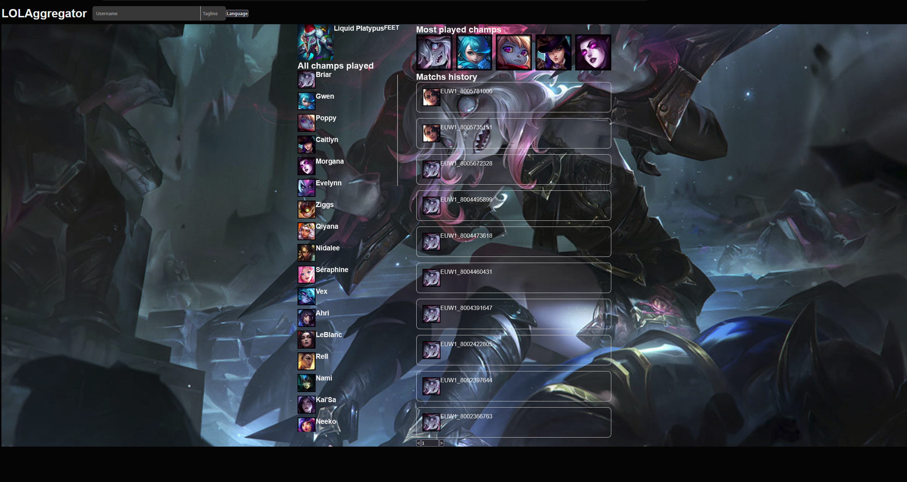

# LOLAggregator

> ⚠️ **Work in progress** — personal project under active development. Screenshots will be added below as the project progresses.

A personal website to search for a **League of Legends** player (via their Riot ID) and browse their stats: profile, champions played, mastery, match history, and soon more advanced aggregated stats (per champion, per item, matchups...).

This project replaces an earlier Streamlit prototype, rebuilt as a proper full-stack app to go further both technically and functionally.

---

## Screenshots

<p align="center">
  
  
	
</p>

## Features

### ✅ Currently available
- Search for a player by **gameName#tagLine** (Riot ID), with live suggestions while typing
- Profile page:
  - Player info (icon, level, name)
  - Full list of champions played with mastery level
  - Top most-played champions
  - Paginated match history
- Static game assets integration (champion images, item images, icons) via Dragontail

### 🚧 In progress / coming up next
- Match detail page (on click from history)
- Per-champion detailed stats: number of games, winrate, average KDA
- Per-item stats (e.g. *"winrate when I have item X on champion Y"*)
- Language selector
- Proper frontend error handling (`error.tsx`)
- Switching from local/scraped data to live Riot API calls once the database is stable

### 💡 Longer-term ideas
- Horizontal item-purchase timeline cross-referenced with match events (kills, objectives) and the opposing matchup — requires Riot's Timeline API, put on hold for now given its complexity

---

## Tech stack

### Backend
- **Python** + **FastAPI**
- **PostgreSQL** (via Docker) for data persistence
- **SQLAlchemy** as ORM
- **pandas** for data transformation
- Calls to the **Riot Games API** + static **Dragontail** data (champions, items, images)

### Frontend
- **Next.js** (App Router) + **TypeScript**
- **CSS Modules** for styling (no CSS framework)

### Infrastructure (planned)
- Full containerization via **Docker** (one container per service: backend, frontend, DB, reverse proxy)
- **Nginx** as reverse proxy

---

## Architecture

```
backend/
├── main.py              # FastAPI routes (orchestration only)
├── config.py             # Environment variables
├── api/
│   ├── riot.py           # Raw calls to the Riot API (with rate limit handling)
│   └── dragon.py         # Reading static Dragontail data
├── data/
│   ├── processor.py      # Data transformation/aggregation
│   └── local_data.py     # Reading locally scraped data (dev)
├── database/
│   ├── connection.py     # SQLAlchemy connection / engine / session
│   ├── models.py         # Table models (ORM)
│   ├── init_db.py        # Table creation
│   ├── populate_static.py   # Populating static tables (Champion, Item)
│   └── populate_dynamic.py  # Populating dynamic tables (User, Match, Participation...)
└── scraper.py            # One-shot scraping of personal data for local development

frontend/
└── src/
    ├── app/               # Pages (App Router)
    └── components/        # Reusable components (SearchBar, MatchsHistory...)
```

### Database

Relational schema with 8 tables, designed to avoid unnecessary Riot API refetches:

- **Static tables** (Dragontail): `Champion`, `Item`
- **Dynamic tables** (Riot API): `User`, `Summoner`, `Match`, `Participation` (User↔Match join), `ChampionMastery` (User↔Champion join), `Participation_item` (Participation↔Item join)

---

## Why a database?

A match never changes once it's been played. Rather than hitting the Riot API on every visit (expensive, rate-limited, and redundant), data is cached in the database once and for all. This also turns otherwise costly features (per-champion stats, per-item stats...) into simple SQL queries instead of repeated API calls.

---

## Local development

During development, a scraping system avoids burning through the Riot API quota (limited to 100 requests/2min on a dev key):

1. `scraper.py` pulls all of the personal account's data once into local JSON files
2. A `USE_LOCAL_DATA` flag in `.env` switches between local reads and real API calls, completely transparently for the rest of the code

---

## Getting started

### Prerequisites
- Python 3.x + a virtual environment
- Node.js + npm
- Docker (for PostgreSQL)
- A Riot Games API key
- Dragontail data given by Riot : https://developer.riotgames.com/docs/lol (under "Data Dragon")

### Backend

```bash
cd backend
python3 -m venv venv
source venv/bin/activate
pip install -r requirements.txt

# start the PostgreSQL container (first time only)
docker run --name lolaggregator-db -e POSTGRES_PASSWORD=<password> -e POSTGRES_DB=lolaggregator -p 5432:5432 -d postgres

# create and populate the database (first time only)
python -m database.init_db
python -m database.populate_static
python -m database.populate_dynamic

# run the dev server
fastapi dev main.py
```

Make sure a `.env` file is set up with `API_KEY`, `REGION`, `PLATFORM`, `DRAGON_PATH`, `CONNECTION_STRING`, and `USE_LOCAL_DATA`.

### Frontend

```bash
cd frontend
npm install
npm run dev
```

The frontend expects the backend to be running at `http://localhost:8000`.

_Coming soon — screenshots of the current progress will be added here._
